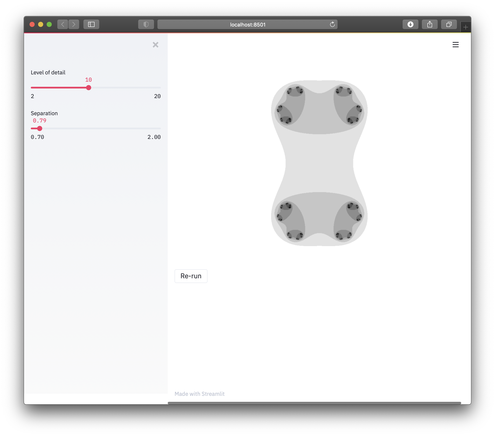

👋 

This is a minimal example of how to install Streamlit on Heroku.

Thanks to [emunozlorenzo](https://github.com/emunozlorenzo/Deploying-Streamlit-with-Heroku) and [Gilbert Tanner](https://gilberttanner.com/blog/deploying-your-streamlit-dashboard-with-heroku) for previous documentation.

 

## One-click deployment

If you have a heroku account and you just want to test this out, you can deploy with this button:

If you want to actually set up a development environment, you'll need to create a repository.

## Clone, edit and deploy a Streamlit site

  - Get a Heroku account 
  - Install [Heroku CLI](https://devcenter.heroku.com/articles/getting-started-with-python)
      - `brew tap heroku/brew && brew install heroku`
  - Authenticate the CLI locally: `heroku login` 
  - Clone this repo into a directory like "my-project-name"
    - `git clone git@github.com:christopherfrance/streamlit-on-heroku.git my-project-name`
  - `cd my-project-name`
  - Edit `setup.sh` to use your email address.
  - Install python dependencies locally in a virtual environment using [pipenv](https://pypi.org/project/pipenv/)
    -  `pipenv install`
  - Run streamlit app in the browser locally: 
    - `streamlit run app.py`
  - Create the remote heroku projet: 
    - `heroku create`
  - Commit your work: 
    - `git add .` 
    - `git commit -m "Initial commit!"`
  - Push the code to Heroku: 
    - `git push heroku master`
  
It should install requirements automatically on push, and give you a live URL in your terminal.  

You probably also want a normal repository on github. Don't rely on Heroku to work like a normal repository.

Change, if you cloned the repo, change the `origin` remote to point to a new github project.

  - Make your new repo the origin for your new project: 
    - `git remote rm origin`
    - `git remote add origin [address of your new project]`
  - Push to github `git push origin master`

(Alternatively, fork this repo to get started, instead of cloning it.)

If you need to configure Heroku:

  - Set an environment variable: `heroku config:set KEY=VALUE`
  - Read about the [Heroku CLI](https://devcenter.heroku.com/articles/heroku-cli)

If you have problems with this guide:

  - Also try checking the [Streamlit posts with the Heroku tag](https://discuss.streamlit.io/tag/heroku).
  - Bug reports welcome. — @christopherfrance
